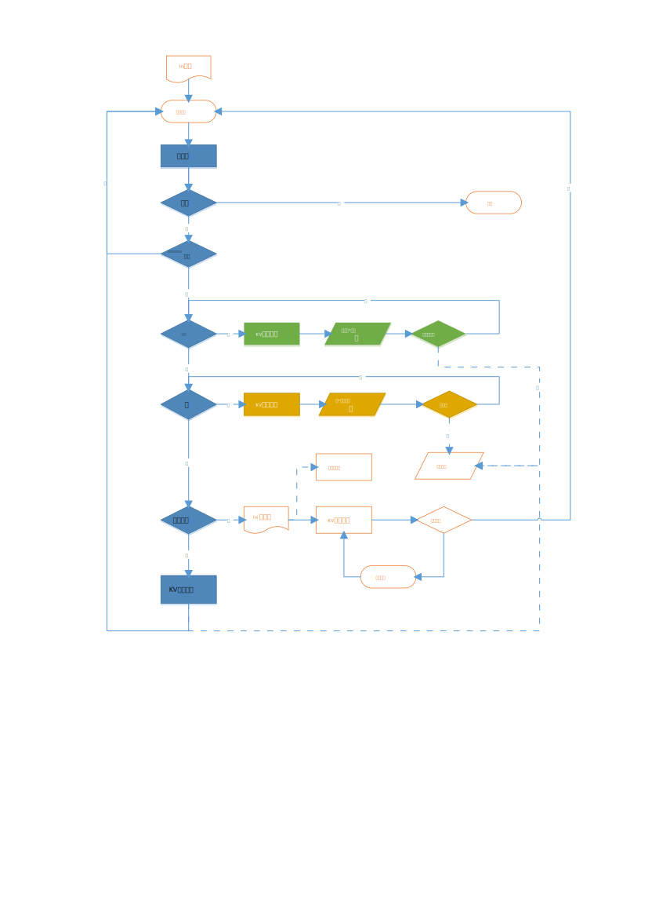

# inigo (go ini 文件解析库)
> - @author Joshua Conero
> - @descrip ini 文件解析器

## 项目管理
- ``master`` 主分支；用户可下载使用
- ``alpha`` 开发数据分支(develop)，程序开发不直接操作``master`` 而由开发该分组再合并到主分支
- ``demo`` 项目实际测试；
- ``document`` 项目文档
- ``v{n}`` 历史版本分支，历史保存


## 设计

- `Parser`		解析器**接口**
  - `BaseParser`   默认*ini* 文件解析器
  - `RongParser`   *rong* ini 文件解析器
  - `TomlParser`  `toml 文件解析的支持`
- `FileParser` 文件解析器**接口**
- `StrParser` 字符串解析器**接口**


### Base 解析器

*支持基本的 ini 文件解析，和简单的扩展语法*


> 支持类型

------

*与 go 语言特性紧密结合*

```go
bool
b1 = true				// 不区分大小写
b2 = false

int64
i = 56

float64
f64 = 78.455

string
s1 = 字符串，无效引号
s2 = '可使用单引号'
s3 = "依赖可用双引号"

array/slice
// 单行数组
inta = 1, 5, 4, 6, 7, 9
floata = 7.54, 6.24, 74.24
stra = tttt, kdjd, ddd
stra2 = "ffff,fff", 'hhhh', ttt
stra2 = "ffff,fff", 'hhhh', "ttt"


map
// 简单二级"."操作，不能大于三年级如: map.c1.c2
// 该写法与 PHP.ini 配置文件相识，亦可考虑设置开关键
// map[interface{}]interface{}
m.name = map 数据类型处理
m.78 = 5555
```


> 指定定义变量/引用值

```ini
; 定义变量
$var = 85
author = Joshua Conero


str = "the var is : $var"     	; the var is : 85
str2 = 'the var is : $var'     	; the var is : $var
str3 = "the var is : &author"   ; the var is : Joshua Conero
```


> 支持 include 文本引入指令

```ini
; 引入文件
include conf/database.ini

; 批量文件引入
include conf/*.ini
```


## 分支

- v0.x 版本
  - [详情](./doc/readme-v0.x.md)
  - 开发周期： @20170119 - 20170424
    v1.x 版本		(开发中)
  - 开始： 20171028 -> 
    v2.x (版本)	
    - 通过对 go 语言的学习重新库；v1.x中项目设计多数受其他语言的影响，完全按照go语言的风格。


## 使用

### 安装

```ini
# github
$ go get -u  github.com/conero/inigo

```

### 获取解析器

```go
// 获取默认解析器(BaseParser)
ini := inigo.NewParser()

rong := inigo.NewParser("rong")
//或者
rong2 := inigo.NewParser(map[string]interface{}{
    "driver": "rong"
})

```


### 设计流程图


解析操作流程图



